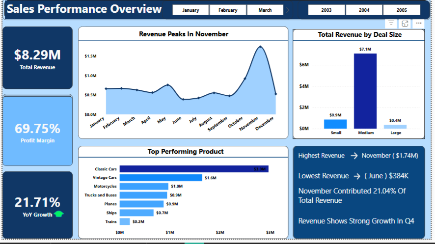

Sales Performance Overview Dashboard

This dashboard provides a comprehensive look at sales dynamics, focusing on revenue seasonality and product performance.

Key Achievements
- **Profit Margin:** Maintained a healthy **69.75%**.
- **Year-over-Year Growth:** Achieved **21.71%** increase.
- **Strategic Insight:** Identified Q4 (specifically November) as the critical sales period.

Tools Used
- Data Visualization: [power bi]
- Data Cleaning: [Power query]

YoY Growth: VAR PriorYear = CALCULATE([Total Revenue],
SAMEPERIODLASTYEAR('Date'[Date]))
RETURN
DIVIDE([Total Revenue] - PriorYear, PriorYear)

​Total Revenue = SUM(Sales[Revenue])

Profit Margin = DIVIDE([Total Profit], [Total Revenue])

Dashboard Preview

​Key Insights: 
* November Peak:
*  Revenue hit **$1.74M,** contributing over 21% of total annual revenue.
​Core Driver:
 "Classic Cars" is the dominant product line **($3.0M)**.
​Market Segment:
"Medium" deal sizes account for the vast majority of revenue ($7.1M).

 Strategic Recommendations
Based on the dashboard insights, I recommend the following:
* **Focus on Q4:** Double down on marketing for "Classic Cars" in November.
* **Deal Strategy:** Prioritize "Medium" size deals to maintain the 21.71% YoY growth.

